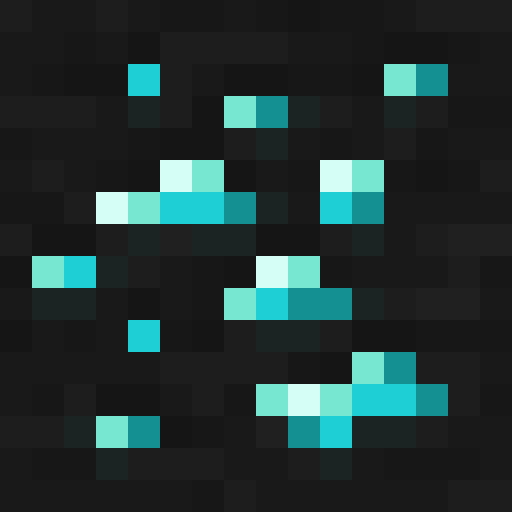

  
  <h2>Glowing</h2>

  Use Optifine/ConnectedTextureMod format let some things glow/emissive.
  <h2>Branch</h2>

  |  Optifine Format                                                  |  ConnectedTextureMod Format                                         |
  |  :-------------------------------------------------------------:  |  :---------------------------------------------------------------:  |
  |  [1.20-OF](https://github.com/7777777-4547/Glowing/tree/1.20-OF)  |  
  |  [1.19-OF](https://github.com/7777777-4547/Glowing/tree/1.19-OF)  |  [1.19-CTM](https://github.com/7777777-4547/Glowing/tree/1.19-CTM)  |
  |  [1.18-OF](https://github.com/7777777-4547/Glowing/tree/1.18-OF)  |  [1.19-CTM](https://github.com/7777777-4547/Glowing/tree/1.18-CTM)  |
  |  [1.17-OF](https://github.com/7777777-4547/Glowing/tree/1.17-OF)  |  [1.17-CTM](https://github.com/7777777-4547/Glowing/tree/1.17-CTM)  |
  |  [1.16-OF](https://github.com/7777777-4547/Glowing/tree/1.16-OF)  |  [1.16-CTM](https://github.com/7777777-4547/Glowing/tree/1.16-CTM)  |
  |  [1.15-OF](https://github.com/7777777-4547/Glowing/tree/1.15-OF)  |  
  |  [1.14-OF](https://github.com/7777777-4547/Glowing/tree/1.14-OF)  |  
  |  [1.13-OF](https://github.com/7777777-4547/Glowing/tree/1.13-OF)  |  
  |  [1.12-OF](https://github.com/7777777-4547/Glowing/tree/1.12-OF)  |  
  |  [1.9-OF](https://github.com/7777777-4547/Glowing/tree/1.9-OF)    |  

  
  <h2>Showcase</h2>
 
  
 
  
 
  
 
  
 
  
 
  
 
  
 
  
 
  
 
  
 
  
 
  
 
  

